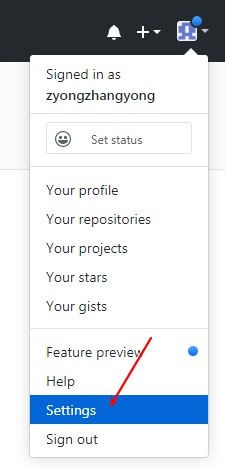
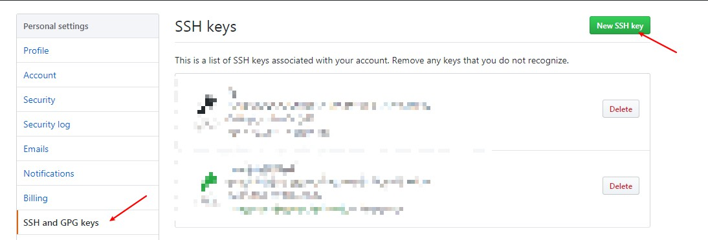
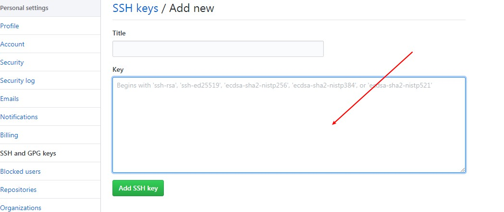
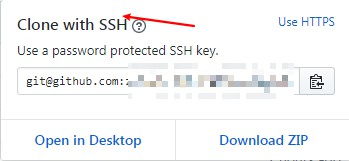

# Base

* status
```bash
$ git status
On branch master
Your branch is up to date with 'origin/master'.

Changes not staged for commit:
  (use "git add <file>..." to update what will be committed)
  (use "git restore <file>..." to discard changes in working directory)
        modified:   docs/myproj/bmp.md
        modified:   mkdocs.yml
```

* add
```bash
$ git add docs/notes/git.md
$ git status
On branch master
Your branch is up to date with 'origin/master'.

Changes to be committed:
  (use "git restore --staged <file>..." to unstage)
        new file:   docs/notes/git.md
```

* commit
```bash
$ git commit -m "add git usage"
[master 564d7bc] add git usage
 1 file changed, 14 insertions(+)
 create mode 100644 docs/notes/git.md

```

* push
```bash
$ git push
Enumerating objects: 8, done.
Counting objects: 100% (8/8), done.
Delta compression using up to 4 threads
Compressing objects: 100% (5/5), done.
Writing objects: 100% (5/5), 628 bytes | 628.00 KiB/s, done.
Total 5 (delta 2), reused 0 (delta 0)
remote: Resolving deltas: 100% (2/2), completed with 2 local objects.
To https://github.com/zyongzhangyong/mainpage.git
   eaea8e7..564d7bc  master -> master

```

# Branch
* view
```bash
	$ git branch
	* master
```
* create
```bash
$ git branch test
Administrator@PC-20180827CUXX MINGW64 /e/git_rep/github/mainpage/mainpage (master)
$ git branch
* master
  test
```
* switch
```bash
$ git branch
* master
  test

Administrator@PC-20180827CUXX MINGW64 /e/git_rep/github/mainpage/mainpage (master)
$ git checkout test
Switched to branch 'test'
M       docs/myproj/bmp.md
M       docs/notes/git.md
M       mkdocs.yml

Administrator@PC-20180827CUXX MINGW64 /e/git_rep/github/mainpage/mainpage (test)
$ git branch
  master
* test
```

* del
```bash
$ git checkout master
Switched to branch 'master'
M       docs/myproj/bmp.md
M       docs/notes/git.md
M       mkdocs.yml
Your branch is up to date with 'origin/master'.

$ git branch
* master
  test

Administrator@PC-20180827CUXX MINGW64 /e/git_rep/github/mainpage/mainpage (master)
$ git branch -d test
Deleted branch test (was 564d7bc).

Administrator@PC-20180827CUXX MINGW64 /e/git_rep/github/mainpage/mainpage (master)
$ git branch
* master
```

# Add ssh key
* create
```bash
ssh-keygen -t rsa -C "your_email@example.com"
```

* add pubkey to github

* * 1.copy pulic key to clipboard 
```bash
clip < ~/.ssh/id_rsa.pub
```
* * 2.click setting



* * 3.click `New SSH key` 


* * 4.copy string from clipboard and add


* clone Repositories with ssh



