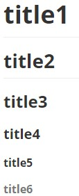

# Markdown

## Title

```bash
# title1
## title2
### title3
#### title4
##### title5
###### title6
```


## Paragraph

* two `space`
* or one `enter`

## List
```bash
* apple1
* apple2
* apple3
```

* apple1
* apple2
* apple3

## Sort list

```bash
1. apple1
2. apple2
3. apple3
```

1. apple1
2. apple2
3. apple3

## Code block

* mul lines

\```bash  
$ git commit -m "test"
[master (root-commit) d6c04d6] test
 1 file changed, 0 insertions(+), 0 deletions(-)
 create mode 100644 test.md  
\```

```bash
$ git commit -m "test"
[master (root-commit) d6c04d6] test
 1 file changed, 0 insertions(+), 0 deletions(-)
 create mode 100644 test.md
```
\```c  
printf("%s", hello);  
\```

```c
printf("%s", hello);
```

* one line

\`this is code\`

`this is code`

## Link

```
[github](https://github.com/)
```

[github](https://github.com/)

## Image
```

```


## Dividing line
```
***
```

***

## Quote 
```
> this is quote1
>> this is quote2
```

> this is quote1
>> this is quote2

## Table

```
head11111|head22222|head3333
-|:-:|-:
item1|item2|item3
item1|item2|item3
```

\-  left align  
:-: mid align  
-:  right align  

head11111|head22222|head3333
-|:-:|-:
item1|item2|item3
item1|item2|item3
