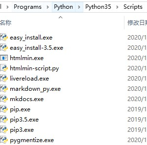

# pip

## set up

* pip is already installed after installed python(>=2.7.9 or >=3.4)
* add `Python\Pythonxx\Scripts` to Environment variable


## pip source

### temporary

```bash
pip install mkdocs -i https://pypi.tuna.tsinghua.edu.cn/simple/
```

### permanent

on windows
* create a pip directory `C:\Users\xx\pip`
* create `pip.ini` in pip directory file
* edit file

```bash
 [global]
 index-url = https://pypi.tuna.tsinghua.edu.cn/simple
```